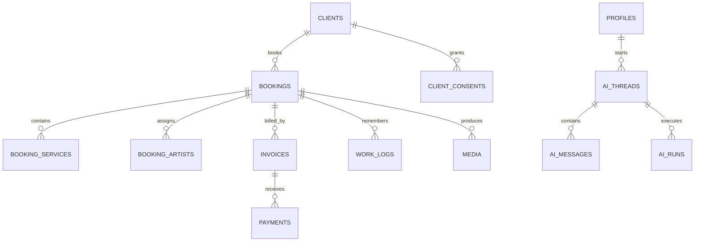

# Sculpy database V2

This architecture keeps the existing demo intact and adds the production-grade records needed before real customer data is imported.

## Access model

| Person / role | Business records | Money | Own assigned work | AI usage log | Audit / technical data |
| --- | --- | --- | --- | --- | --- |
| Miranda · owner | All | All | Yes | Her own | No |
| Jz · operations | All | All | Yes | All | Yes |
| Artist | Assigned only | Service details only | Yes | Own | No |
| Read-only | Explicit future use | No | No | Own | No |

The database enforces this with row-level security. Hiding a menu item is not treated as security.

## Record model

## Why the financial structure changed

`bookings.price_cad` remains temporarily for compatibility. New production records use `booking_services` line items, invoices and payments. This allows one booking to contain trial, bride, family, travel and touch-up services, while revenue charts use successful payments instead of a manually entered booking total.

The `booking_financials` and `service_revenue_monthly` views are the trusted calculation layer. Sculpy may explain those results, but the model does not calculate or invent the totals.

## Sculpy data boundary

Sculpy will never receive a raw database connection. The authenticated server reads only records permitted by row-level security, runs an approved tool/query, and sends a small result set to the model. Each run records its purpose, source record IDs, output record IDs, token usage and estimated cost.

Voice input follows the same rule: audio becomes a transcript, the transcript becomes a pending `ai_draft`, and a human confirms it before permanent client or booking records change.

## Migration order

1. Apply `001_initial_schema.sql` to an empty private Supabase project.
2. Apply `002_production_core.sql`.
3. Create real Auth users for Jz and Miranda, then insert their `profiles` rows as `operations` and `owner`.
4. Add artists and link each `artists.profile_id` only after their invite is accepted.
5. Test every role with non-sensitive sample data before importing real clients.

Do not run the production migration against the public demo project if it still contains browser-facing sample access.
